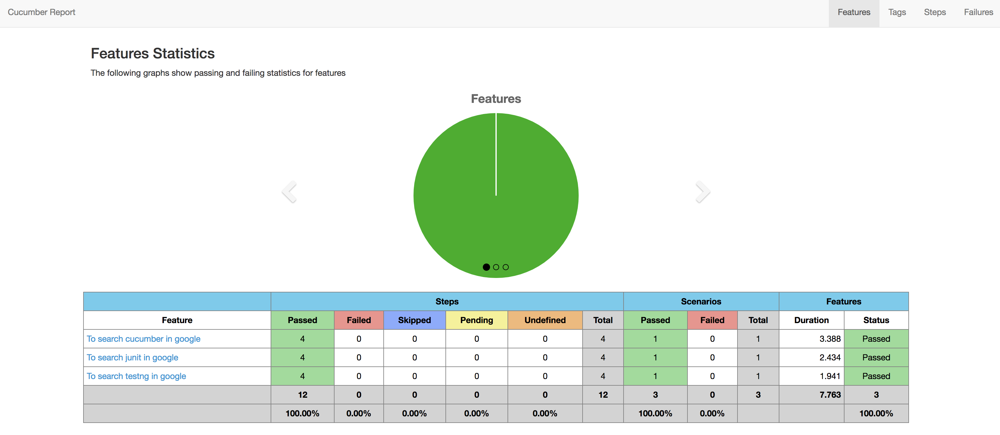
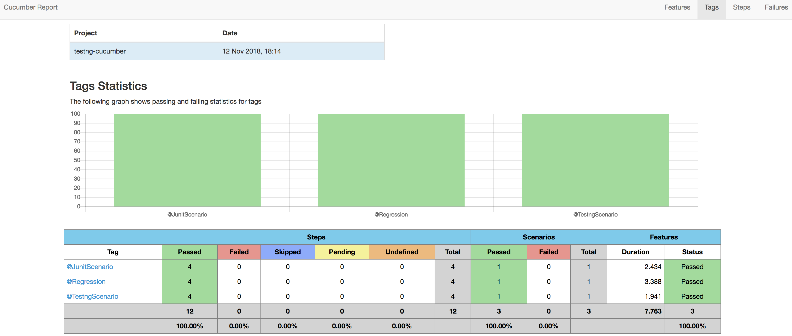
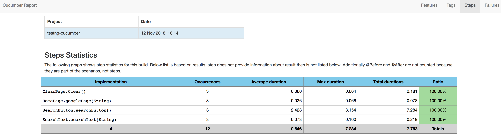

## Testng-Cucumber-Boilerplate  [](https://travis-ci.org/igniteram/testng-cucumber)
Simple boilerplate to kick start your testng-cucumber maven java project with some additional features like "CucumberOptions": tags, glue, screenshots, set environment/browser methods
## Features
* Crisp & Clear maven folder structures
* Extensive methods in CucumberRunner class
* CucumberOptions with detailed explanation of using "tags", "glue"
* Screenshots on failure feature in **CucumberRunner** class
* TestNG Annotations/hooks like "BeforeSuite", "AfterClass", "AfterMethod" etc.
* Descriptive pom.xml and testng.xml
* Examples with multiple features and step definition files
* Methods for running tests in Firefox and Chrome browsers

## To Get Started

#### Pre-requisites
1. Java installed in the system
2. Maven installed in the system

#### Run Scripts
* Fork this repo, keep the folder the structure intact
* Run the following maven command from command line 
```
mvn clean test
```
* The scripts should run successfully in **Chrome** browser as it is defined in the **config.properties** file.
* Target folder should be created with cucumber-html-report and surefire-reports.
* **Test_Output** folder should be created with the default testng reports

#### Writing Features
```
 Feature: To search cucumber in google
     @Regression
     Scenario: Cucumber Google
       Given I am in google page
       When I type "cucumber"
       Then I click submit button
       Then I clear search textbox
```


#### Writing Step Definitions

```
public class Clearpage extends CucumberRunner {
    @Then("^I clear search textbox$")
      public void Clear() throws Throwable {
      driver.findElement(By.cssSelector("input[name='q']")).clear();
    }
}
```


#### Cucumber Options

```
 @CucumberOptions(
      	strict = true,
      	monochrome = true,
      	features = {"src/test/resources/features/"},
      	glue = "stepdefinition",
      	plugin = {"pretty", "html:target/cucumber-html-report" },
      	tags={"@Regression,@JunitScenario,@TestngScenario"}
        )
```


#### Screenshot Hooks/Annotations

```
 @AfterMethod(alwaysRun = true)
     	public void tearDownr(ITestResult result) throws IOException {
     		if (result.isSuccess()) {
     			File imageFile = ((TakesScreenshot) driver).getScreenshotAs(OutputType.FILE);
     			String failureImageFileName = result.getMethod().getMethodName()
     					+ new SimpleDateFormat("MM-dd-yyyy_HH-ss").format(new GregorianCalendar().getTime()) + ".png";
     			File failureImageFile = new File(System.getProperty("user.dir") + "//screenshots//" + failureImageFileName);
     			FileUtils.copyFile(imageFile, failureImageFile);
     		}
     	}
```


#### HTML Reports
Default cucumber HTML reports are generated which can be customized according to specific needs
##### Success Cucumber Reports






## Contributions
For contributors who want to improve this repo by contributing some code, reporting bugs, issues or improving documentation - PR's are highly welcome, please maintain the coding style , folder structure , detailed description of documentation and bugs/issues with examples if possible.